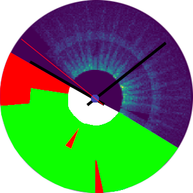

Repository migrated to CERN's Gitlab [here](https://gitlab.cern.ch/cms-dqmdc/services/dials-service).

---

  

# What is DIALS?

This repository contains all components that make up the CMS DQM-DC DIALS service.

During a `Run`, the `CMS Experiment` collects particle collision data in `Lumisection` time-frame and the experiment subsystem health is monitored by `shifters` using [DQMGUI](https://github.com/cms-DQM/dqmgui_prod). Multiple shifters for many subsystems monitor the most recent lumisection of the current run plots to check a subsystem's health, but given the number of plots and the limited manpower it is not possible to closely pay attention to all plots during the lumisection time-frame. On the other hand, using certified data it is possible to extract knowledge from old runs (at lumisection-level) to help shifters get a glimpse of detector's health on past runs.

**D**ata **I**nspector for **A**nomalous **L**umi-**S**ections (DIALS) is an application designed to be an access point to DQMIO per-LS monitoring elements. It is responsible for indexing, storing pre-processed DQMIO data and serving via a WEB UI and REST Api, so that it could be used by any CMS sub-group for exploratory analysis, statistical learning and machine learning.

This application was born in CMS Tracker ML as a prototype under the name "MLPlayground" and was migrated to CMS central DQM-DC as an effort of centralizing anomaly detection techniques and data retrieval for every subsystem.

# Tech stack

This project is a full-stack application written in Python (^3.10) and JavaScript (Node.js ^20.11.0). The backend is built using Django (specifically Django Rest Framework), the job queue is managed by Celery and the frontend is built with plain React. It uses a PostgreSQL database instance for storing all data and Redis in-memory database acting as the message broker for the job queue.

# Documentation

-   [Backend](/backend/README.md)
-   [Frontend ](/frontend/README.md)
-   [Authentication](/docs/AUTHENTICATION.md)
-   [Deployment](/docs/DEPLOYMENT.md)

# Contributing

Check development guidelines [here](/docs/CONTRIBUTING.md) and local development instructions [here](/docs/LOCAL_DEVELOPMENT.md).

# Backlog

A dedicated [project](https://github.com/orgs/cms-DQM/projects/3) was created to track the project's backlog.
