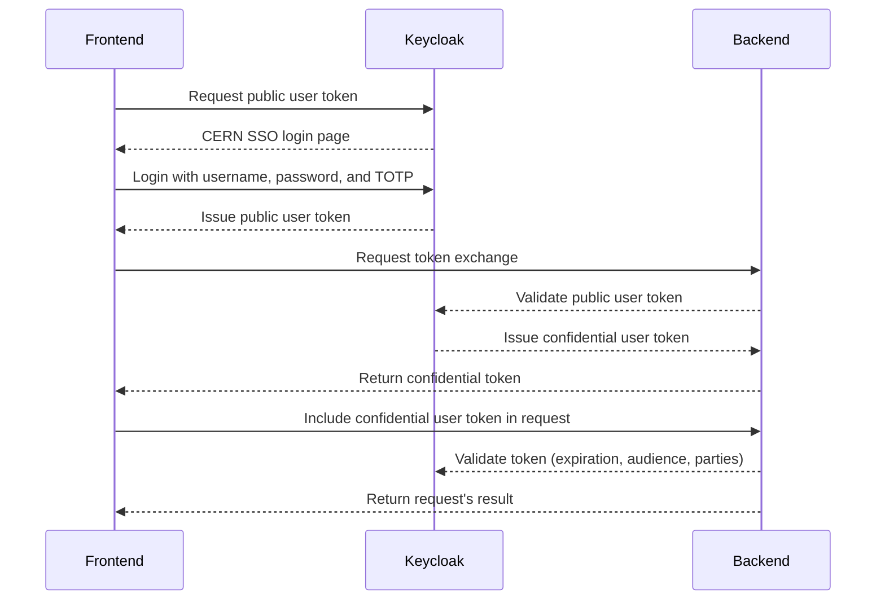
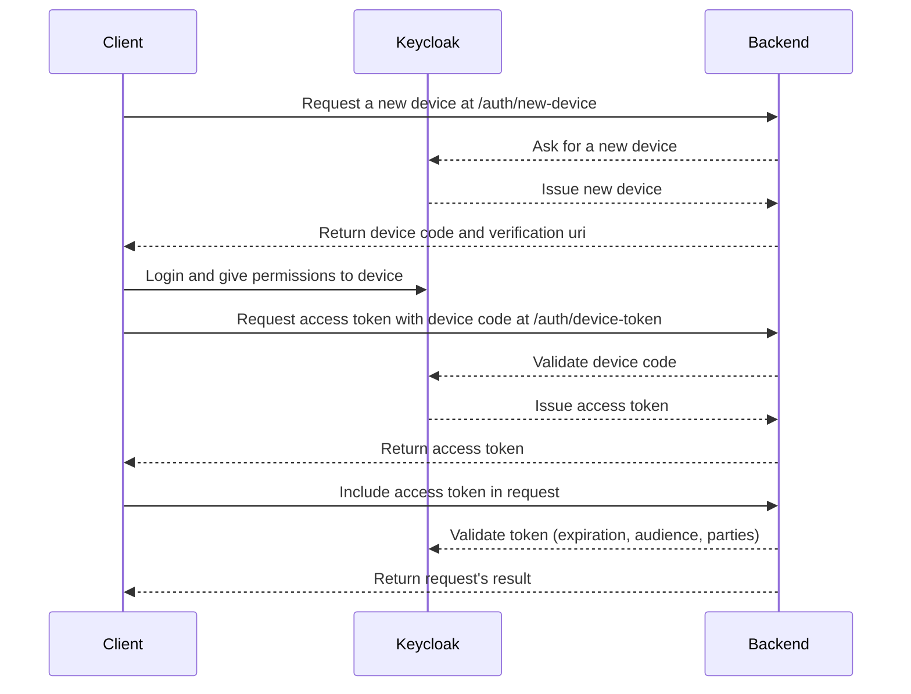
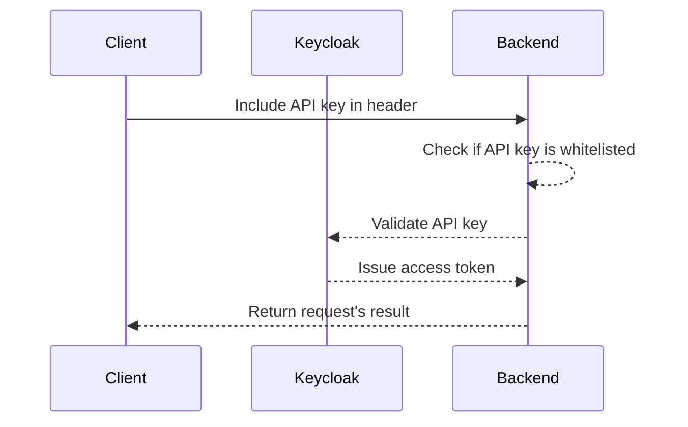

# Authentication

DIALS service has implemented three authentication flows:

1. User (Interactively)
2. Device (Interactively)
3. Machine (Non-interactively)

## User

The interactive authentication flow involves the frontend initiating communication with CERN's Keycloak authentication server. In the case of an insecure application, the frontend requests a public user token, leading the user to the authentication server's login page. The user must then provide their username, password, and time-based one-time password (TOTP).

Subsequently, the frontend communicates with the backend REST API, implemented in Django, to obtain a confidential user token through the designated token-exchange route. The backend ensures the validity of the public user token and verifies that it was sent from the public application, thus ensuring the security of the process.

All requests directed to the backend REST API include the confidential user access token. The backend consistently validates the token for expiration, audience, and authorized parties, ensuring the integrity of each request.

As the expiration of the public user token approaches, stored in the frontend's localStorage, the frontend proactively renews the public user token and initiates a request for a new token exchange, thereby maintaining a continuous and secure authentication flow.

## Device

This interactive user flow is meant to be used by non-machine users trying to retrieve data from DIALS via api-only. It is similar to how you connect a third-party account in you smart TV, it generates a code in the client and you need to go to a website and login with the generated code.

The client ask the backend for a device code and the backend answers with newly generated code and a CERN' SSO authorization url. Them, after login-in you must accept the permissions requested by the device.

After giving the necessary permissions the user must issue a new request to the backend with previously generated device code, the backend will validate that this device code was previously accepted by the authorization server and will issue an access token.

## Machine

In the non-interactive authentication flow, users must request an API key to one of the DIALS maintainers and for every subsequent request the API key must be included in the request header.

The generated API key is registered in the applications portal and whitelisted in DIALS backend's environment variables, whenever the backend receives an api key it is checked against the whitelisted keys and an access token is issued to make sure the api key is still valid in CERN's authentication service. This API key never expires and the user doesn't need to keep track of token expiration, it is meant to be used by robots only.

## Note

- Authentication flow #3 is a workaround (gambiarra, kludge, τσαπατσουλιά /tsapatsoulia/) as the auth server necessitates associating an API key with each user, instead of associating multiple users with an application through e-groups. In other words, for achieving fine-grained API access roles, rather than assigning a role to each user, the approach involves creating an application for each user. However, this method is inefficient as it results in the generation of multiple applications. Alternatively, grouping multiple users within a single application is insecure, as it leads to the sharing of the same client secret key among multiple users.

- Roles can be configured by creating named roles in [Applications Portal](https://application-portal.web.cern.ch) and linking each role to an e-group, the [`PrivateRoute`](/frontend/src/components/auth.js) can be configured to block access based on the registered roles in the public application `dials-public-app`. The application still don't support role based-access solely on the backend (we should implement a custom Permission class for it).
